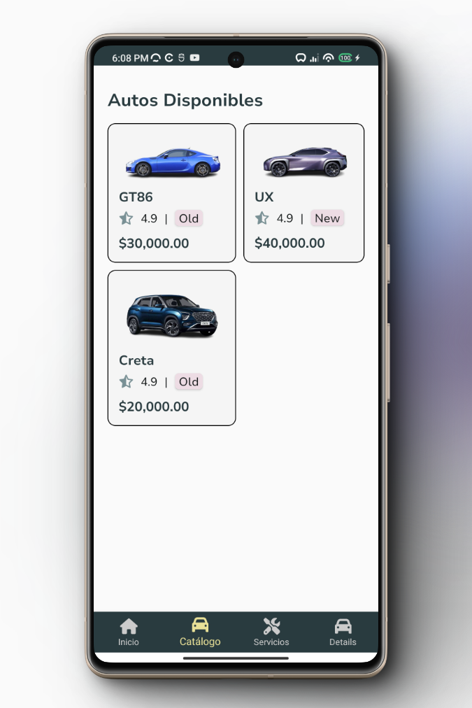
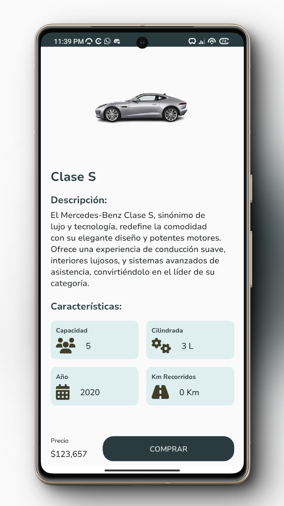
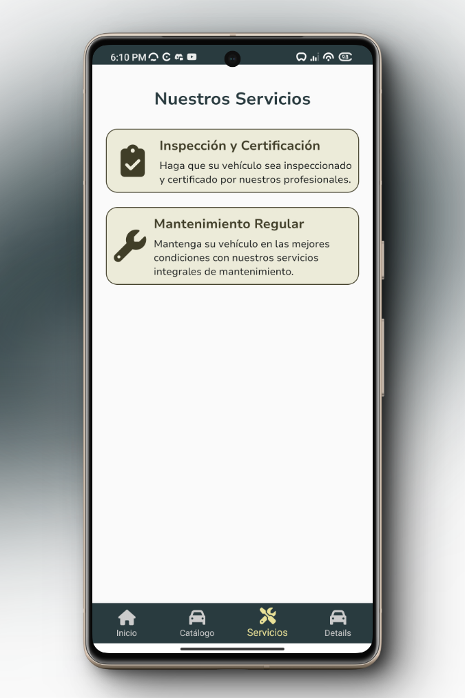

# AteneaApp

## Descripción
AteneaApp es una aplicación móvil desarrollada en Xamarin Forms, diseñada para una concesionaria. La aplicación se conecta a Supabase para gestionar datos de manera eficiente y segura.

## Características
- **Interfaz de usuario intuitiva**: Diseñada para facilitar la navegación y el acceso a las funcionalidades de la aplicación.
- **Conexión a Supabase**: Utiliza Supabase para el manejo de la base de datos en tiempo real.
- **Multiplataforma**: Compatible con dispositivos Android e iOS gracias al uso de Xamarin Forms.

## Tecnologías Utilizadas
- Xamarin Forms
- Supabase

## Instalación
Para instalar y ejecutar AteneaApp en tu entorno local, sigue estos pasos:
1. Clona el repositorio en tu máquina local.
2. Abre el archivo `AteneaApp.sln` con Visual Studio.
3. Restaura los paquetes NuGet necesarios.
4. Construye y ejecuta la aplicación.

## Contribuir
Si deseas contribuir al proyecto, por favor sigue estos pasos:
1. Haz un fork del repositorio.
2. Crea una rama para tus cambios.
3. Realiza tus modificaciones.
4. Envía un pull request para que tus cambios sean revisados.

## Capturas de Pantalla
A continuación, se muestran algunas capturas de pantalla de la aplicación móvil:

### Pantalla de Inicio

### Pantalla de Catálogo de Vehículos

### Pantalla de Detalle del Vehículo

### Pantalla de Servicios

## Contacto
Si tienes alguna pregunta o sugerencia, no dudes en contactarte conmigo.

---
Desarrollado con ❤️ por Jean Paul Vasquez.
